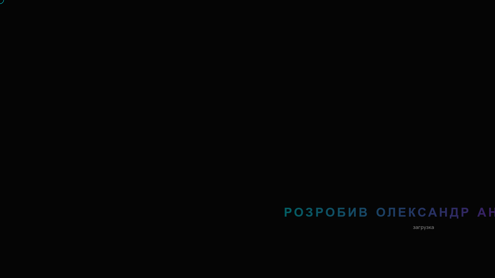
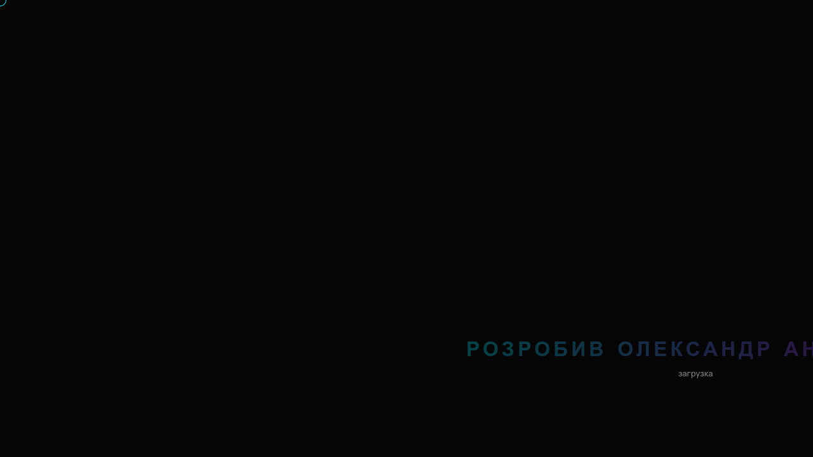
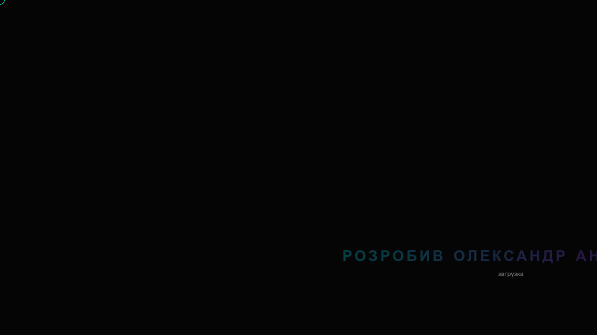

# Ozone Layer Immersive Experience

## English
An interactive educational page about the ozone layer with visual effects and scroll-based animation.

### Features
- Immersive animated landing page.
- Three.js/GSAP-based visual effects.
- Static frontend project.

### Screenshots

### Run locally
Use any static file server and open the project in a browser. Example: Python built-in HTTP server on port 8000.

## Русский
Интерактивная образовательная страница про озоновый слой с визуальными эффектами и анимациями.

### Возможности
- Immersive animated landing page.
- Three.js/GSAP-based visual effects.
- Static frontend project.

### Скриншоты

### Локальный запуск
Запусти любой статический HTTP-сервер и открой проект в браузере. Например, встроенный Python HTTP server на порту 8000.

## Українська
Інтерактивна освітня сторінка про озоновий шар із візуальними ефектами та анімаціями.

### Можливості
- Immersive animated landing page.
- Three.js/GSAP-based visual effects.
- Static frontend project.

### Скріншоти

### Локальний запуск
Запусти будь-який статичний HTTP-сервер і відкрий проєкт у браузері. Наприклад, вбудований Python HTTP server на порту 8000.
